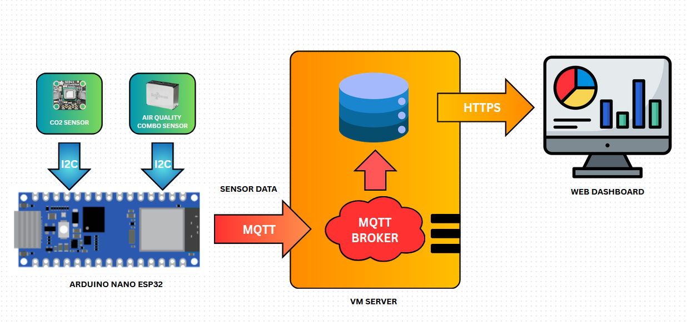
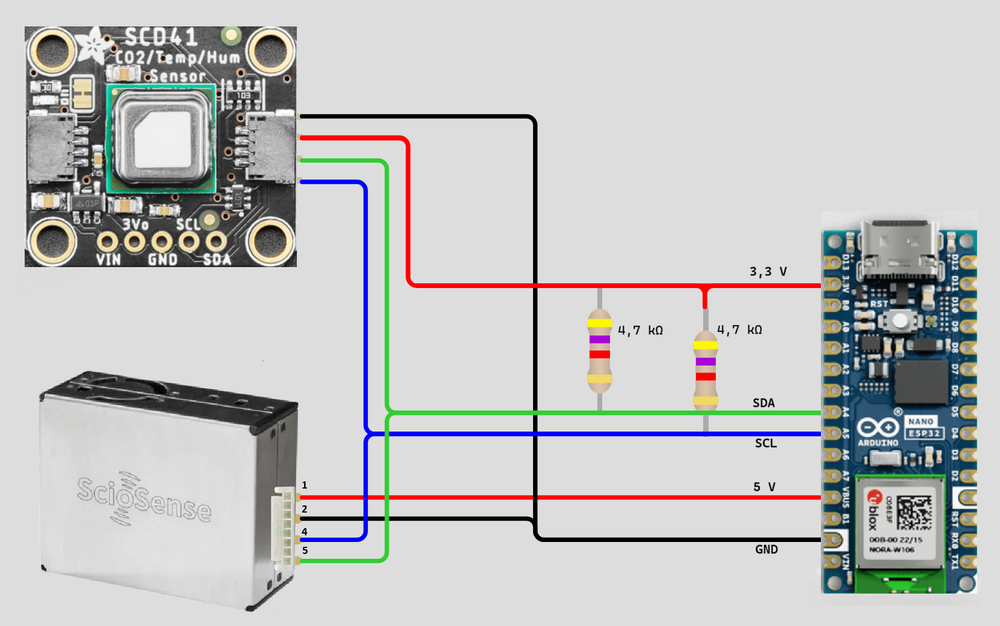

# TAMK Air Quality Monitoring

This project is a Wi-Fi connected air quality monitoring system based on the Arduino Nano ESP32 microcontroller with I2C-connected air quality sensors to measure environmental data and send it to a database. The main goal is to collect and store data for teaching purposes.

---

## Features

### Hardware (Arduino Nano ESP32)
- Air quality monitoring over I2C
- Wi-Fi connectivity with connection recovery
- Time synchronization via NTP
- MQTT messaging with highest quality of service

### Backend (VM server 172.16.7.177)
- MQTT Listener and processing pipeline
- REST and GraphQL APIs (FastAPI)
- GraphQL endpoint for Flexible query
- PostgreSQL database (async access)
- Role-based authentication (JWT, API key)
- Webhook system for event notifications
- Rate limiting, structured logging, secure secret handling

→ See the [Backend Architecture](./-/wikis/Architecture) and [API Reference](./-/wikis/API-Reference) for full details.

### Frontend
- Real-time monitoring dashboard
- Historical CO₂ graph and air quality index display

---

## Hardware Details

- [Arduino Nano ESP32](https://store.arduino.cc/products/nano-esp32) ([datasheet](https://docs.arduino.cc/resources/datasheets/ABX00083-datasheet.pdf))
- [APC1 Air Quality Combo Sensor](https://www.sciosense.com/apc1-air-quality-combo-sensor/) ([datasheet](https://www.sciosense.com/wp-content/uploads/2024/07/APC1-Datasheet.pdf))
- [Adafruit SCD-41](https://www.adafruit.com/product/5190) ([datasheet](https://cdn-learn.adafruit.com/downloads/pdf/adafruit-scd-40-and-scd-41.pdf))

Each device generates a unique ID on first startup (stored in non-volatile memory). Currently used IDs:
- Pink: `5d156a9d-7a7e-4f9c-9a42-899c07ae6068`
- Green: `7f34dd9f-44bc-4163-aef2-a6b44fc2da98`
- Purple: `001d29e2-4b78-4c79-ba9d-6c85573d1f02`



---

## Arduino Installation & Use

- Connect sensors to Arduino Nano ESP32
- Install Arduino IDE and required libraries
- Fill in network and MQTT credentials in `arduino_secrets.h`
- Upload `a3_air_quality.ino` to the device
- Optional: use 3D-printed [case](Arduino/a3_air_quality/case_and_top_cover.step) for neat packaging



---

## Backend Installation & Use

The backend is containerized and can be started via Docker Compose:

```bash
cp .env.template .env
docker compose up --build

- Automatically launches FastAPI backend + PostgreSQL  
- Swagger UI: [http://localhost:8000/docs](http://localhost:8000/docs)  
- Admin onboarding and API usage covered in the [Getting Started](./-/wikis/Getting-Started) guide  

---

## Frontend Installation

*Coming soon: frontend repo with dashboard and analytics.*

---

## Documentation

Detailed backend documentation is available in the project wiki:

- [Getting Started](./-/wikis/Getting-Started)
- [Architecture](./-/wikis/Architecture)
- [Database Schema](./-/wikis/Database-Schema)
- [Testing & Debugging](./-/wikis/Testing-&-Debugging)

---

## MIT License

Copyright (c) 2025 TAMK Air Quality Monitoring Project Contributors

Permission is hereby granted, free of charge, to any person obtaining a copy
of this software and associated documentation files (the “Software”), to deal
in the Software without restriction, including without limitation the rights  
to use, copy, modify, merge, publish, distribute, sublicense, and/or sell      
copies of the Software, and to permit persons to whom the Software is          
furnished to do so, subject to the following conditions:                       

The above copyright notice and this permission notice shall be included in     
all copies or substantial portions of the Software.                            

THE SOFTWARE IS PROVIDED “AS IS”, WITHOUT WARRANTY OF ANY KIND, EXPRESS OR     
IMPLIED, INCLUDING BUT NOT LIMITED TO THE WARRANTIES OF MERCHANTABILITY,       
FITNESS FOR A PARTICULAR PURPOSE AND NONINFRINGEMENT. IN NO EVENT SHALL THE    
AUTHORS OR COPYRIGHT HOLDERS BE LIABLE FOR ANY CLAIM, DAMAGES OR OTHER         
LIABILITY, WHETHER IN AN ACTION OF CONTRACT, TORT OR OTHERWISE, ARISING FROM,  
OUT OF OR IN CONNECTION WITH THE SOFTWARE OR THE USE OR OTHER DEALINGS IN THE  
SOFTWARE.

